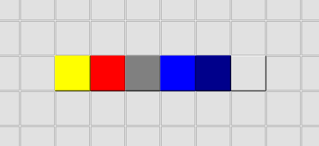
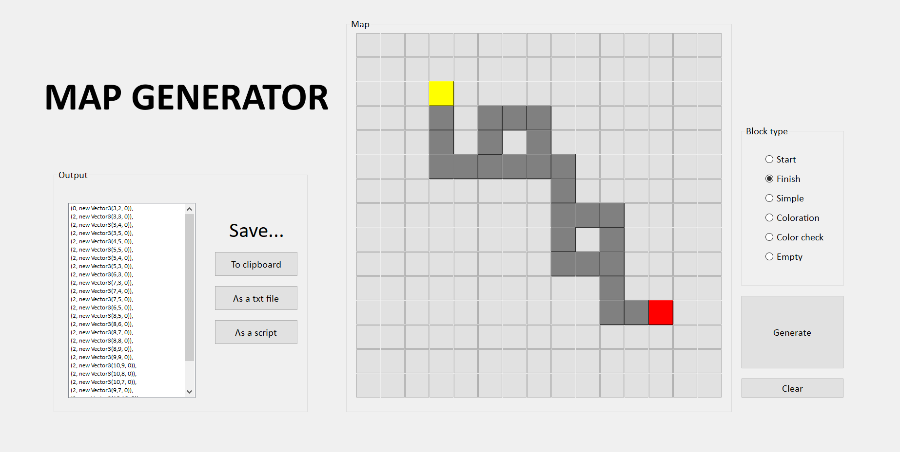

# Map code generator v1.0

## Installation 

```
$ git clone <link_on_rep>
```
## Usage
File name ```run_to_start``` in source directory means something

### Colors

- Start - yellow
- Finish - red
- Simple -gray
- Coloration -blue
- Color check - darkBlue
- Clear - #e1e1e1

### Interface

#### Note: 
Only saving **as txt** is available now 